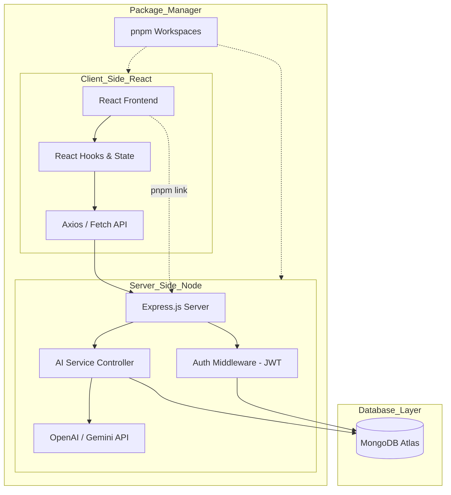

# 🤖 ConvoAI

A high-performance ChatGPT clone built with the **MERN Stack** (MongoDB, Express, React, Node.js) and managed via **pnpm workspaces**.

## 📖 About this Project
This project was developed as part of the **Delta Full-Stack Web Development** course by **Apna College**. While the core logic follows the course curriculum, I have implemented several enhancements to make it production-ready and developer-friendly.


## 🌟 Overview
ConvoAI is a full-stack AI conversation platform that features real-time messaging, persistent chat history, and a modern, responsive UI. By leveraging pnpm workspaces, this project maintains a clean separation between the frontend and backend while sharing dependencies efficiently.

## ✨ Features
- **Real-time AI Interaction:** Seamless chat experience powered by OpenAI/Gemini.
- **Monorepo Architecture:** Managed with `pnpm` for faster installs and disk space efficiency.
- **Persistent Storage:** MongoDB integration to save and resume conversations.
- **Secure Auth:** JWT-based user authentication system.
- **Markdown Rendering:** Full support for code snippets and rich text in AI responses.

## 🛠️ Tech Stack
| Layer | Technology |
| :--- | :--- |
| **Package Manager** | [pnpm](https://pnpm.io/) |
| **Frontend** | React (Vite), Tailwind CSS, Framer Motion |
| **Backend** | Node.js, Express.js |
| **Database** | MongoDB Atlas |
| **AI Engine** | OpenAI API |

Project Document

[ConvoAi.pdf](https://github.com/user-attachments/files/25937329/ConvoAi.pdf)


## 🏗️ ConvoAI System Architecture

## 🚀 Getting Started

### 1. Prerequisites
- **pnpm** installed: `npm i -g pnpm`
- **Node.js** (v18+)
- **OpenAI API Key**

### 2. Installation
Clone the repository and install all dependencies for both frontend and backend at once:

```bash
git clone [https://github.com/jayalloyd/ConvoAI.git](https://github.com/jayalloyd/ConvoAI.git)
cd ConvoAI
pnpm install
